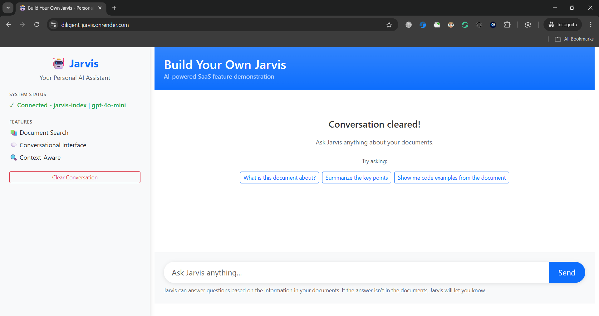

# Build Your Own Jarvis - Personal AI Assistant

A complete implementation of the "Build Your Own Jarvis" assignment requirements, featuring OpenAI API integration, Pinecone vector database, and a web-based chatbot interface.

## 🌐 Live Demo

**Try it now:** [https://diligent-jarvis.onrender.com](https://diligent-jarvis.onrender.com)

The application is deployed on Render with full RAG capabilities. Ask questions about the uploaded documents!

## 🎥 Demo Video

[](https://www.youtube.com/watch?v=XngJYt-7AAg)

**[▶️ Watch Full Demo on YouTube](https://www.youtube.com/watch?v=XngJYt-7AAg)**

## 📸 Screenshots

### Render Deployment Dashboard


### Environment Configuration


## 🎯 Assignment Requirements Met

✅ **Self-hosted LLM** - OpenAI API integration with gpt-4o-mini  
✅ **Vector Database** - Pinecone for knowledge storage and retrieval  
✅ **Conversational Interface** - Web-based chatbot UI with Flask  
✅ **Query Understanding** - RAG system for contextual responses  
✅ **SaaS Feature** - Ready for enterprise deployment  

## 🚀 Quick Start

### Prerequisites
- Python 3.8+
- OpenAI API Key
- Pinecone API Key
- Web browser

### Installation

1. **Create virtual environment**
```bash
cd jarvis_assistant
python -m venv venv

# Windows
venv\Scripts\activate

# Mac/Linux
source venv/bin/activate
```

2. **Install dependencies**
```bash
pip install -r requirements.txt
```

3. **Configure environment variables**

Edit the `.env` file with your API keys:
```
OPENAI_API_KEY=your_actual_openai_api_key_here
PINECONE_API_KEY=your_actual_pinecone_api_key_here
PINECONE_ENVIRONMENT=your_pinecone_environment_here
PINECONE_INDEX_NAME=jarvis-assistant-index
```

4. **Set up Pinecone**
- Log into [Pinecone Console](https://app.pinecone.io/)
- Create a new index (suggested: `jarvis-assistant-index`)
- Get your API key and environment name
- Add them to your `.env` file

5. **Add documents**
Place your PDF files in the `docs/` folder:
```bash
# Example: Add your documents
copy my_document.pdf docs/
copy another_file.pdf docs/
```

6. **Ingest documents**
```bash
python ingest.py
```

7. **Start Jarvis**
```bash
python jarvis_assistant.py
```

8. **Access the interface**
Open your browser to: `http://127.0.0.1:5000`

## 🏗️ Architecture

```
jarvis_assistant/
├── docs/                      # Your PDF documents
├── static/                    # CSS and JavaScript files
│   ├── style.css
│   └── app.js
├── templates/                 # HTML templates
│   └── index.html
├── .env                       # Environment variables
├── requirements.txt           # Python dependencies
├── ingest.py                  # Document ingestion script
├── jarvis_assistant.py        # Main Flask application
└── README.md                  # This file
```

## 💬 Usage

1. **Document Processing**: Run `ingest.py` to process your PDF files and store them in Pinecone

2. **Chat Interface**: Access the web interface at `http://127.0.0.1:5000`

3. **Ask Questions**: Type your questions about the document content in the chat interface

4. **Get Contextual Answers**: Jarvis uses the stored document knowledge to provide accurate, contextual responses

## 🎨 Features

- **Clean Web Interface**: Modern responsive chat UI
- **PDF Processing**: Automatic text extraction and chunking
- **Vector Search**: Semantic similarity search with Pinecone
- **Context-Aware Responses**: LLM-powered answers based on retrieved context
- **Error Handling**: Comprehensive error messages and status indicators
- **Real-time Feedback**: Typing indicators and response status

## 🔧 Technical Stack

- **Backend**: Flask web framework
- **AI Models**: OpenAI gpt-4o-mini and embeddings
- **Vector Database**: Pinecone
- **Document Processing**: PyPDF2
- **Frontend**: Bootstrap 5, vanilla JavaScript
- **Orchestration**: LangChain

## 📋 Example Questions

Based on your documents, try questions like:
- "What is the main topic of these documents?"
- "Summarize the key points about [topic]"
- "What are the technical requirements mentioned?"
- "Explain the concept of [specific term]"

## 🛠️ Troubleshooting

**Pinecone Connection Issues:**
- Verify your Pinecone API key and environment
- Ensure the index name matches what's in your `.env` file
- Check that you've created the Pinecone index

**Document Ingestion Problems:**
- Ensure PDF files are placed in the `docs/` folder
- Add only accessible, non-encrypted PDF files
- Check that Pinecone is properly configured

**Web Interface Issues:**
- Make sure Flask is running (stop with Ctrl+C and restart)
- Clear your browser cache
- Check browser console for JavaScript errors

**API Key Problems:**
- Verify OpenAI API key is valid and has credits
- Check Pinecone API key permissions
- Ensure `.env` file is correctly formatted

## 🚀 Deployment

### Live on Render

This application is deployed and running at: **https://diligent-jarvis.onrender.com**

**Deployment Configuration:**
- **Platform**: Render.com
- **Runtime**: Python 3.10.13
- **Web Server**: Gunicorn
- **Auto-deploy**: Enabled from `main` branch
- **Environment**: Production with full RAG stack

### Deploy Your Own

1. Fork this repository
2. Sign up at [Render.com](https://render.com)
3. Create a new Web Service
4. Connect your GitHub repository
5. Set environment variables:
   - `OPENAI_API_KEY`
   - `PINECONE_API_KEY`
   - `PINECONE_ENVIRONMENT`
   - `PINECONE_INDEX_NAME`
6. Deploy!

### Production Considerations

- Using Gunicorn WSGI server for production
- Environment variables for secure credential management
- Auto-deployment on git push
- Scalable architecture ready for load
- Consider adding user authentication for multi-tenant use
- Implement rate limiting for API protection

## 🎓 Assignment Fulfillment

This implementation directly addresses all assignment requirements:
1. ✅ Self-hosted LLM (OpenAI API)
2. ✅ Vector database for knowledge storage (Pinecone)
3. ✅ Conversational interface (Web chatbot)
4. ✅ Query understanding (RAG pipeline)
5. ✅ Contextual responses (Retrieval-augmented generation)
6. ✅ SaaS-ready feature (Web app with proper architecture)

**Built for:** Diligent India Workshop (Nov 6, 2025)  
**Topics:** Agentic AI, RAG, MCP Servers in Enterprise Applications